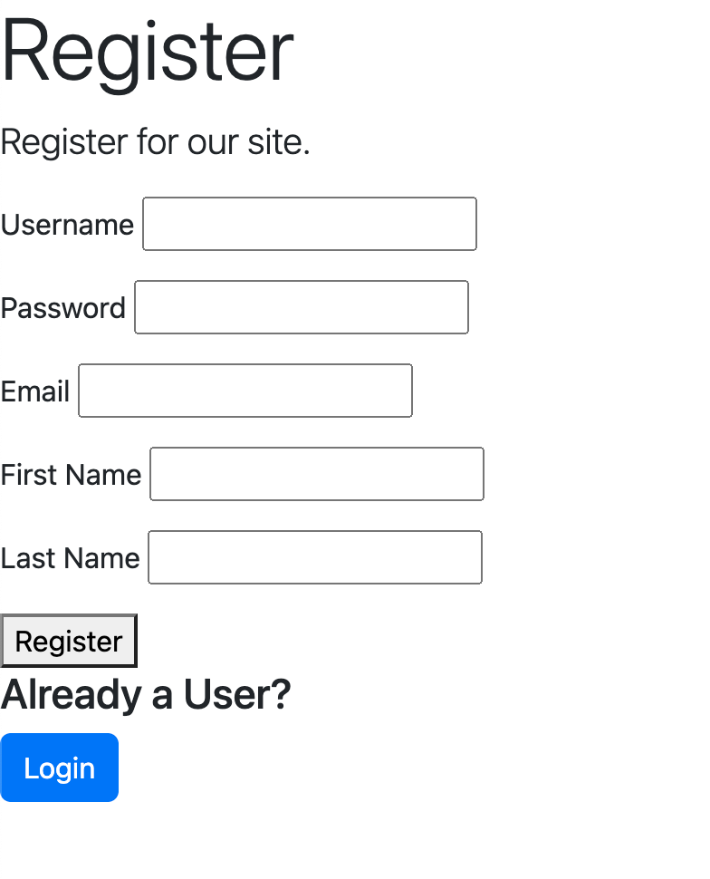
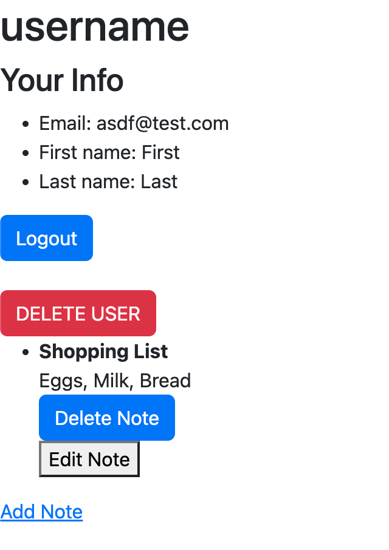

# Flask Notes

Python Flask app for notes with user login and adding, editing, and deleting notes

## To run

1. Open the project subfolder  
2. Create a virtual environment  

        python3 -m venv venv  

3. Install from requirements.txt  

        pip3 install -r requirements.txt  

4. Run with flask  

        flask run  
    
    For Macs, usually some process already listen on port 5000 and you'll need to run  

        flask run -p 5001  

5. Then visit localhost:5000 or localhost:5001 on your browser  

## Screenshots

Users login  

User's notes page  

